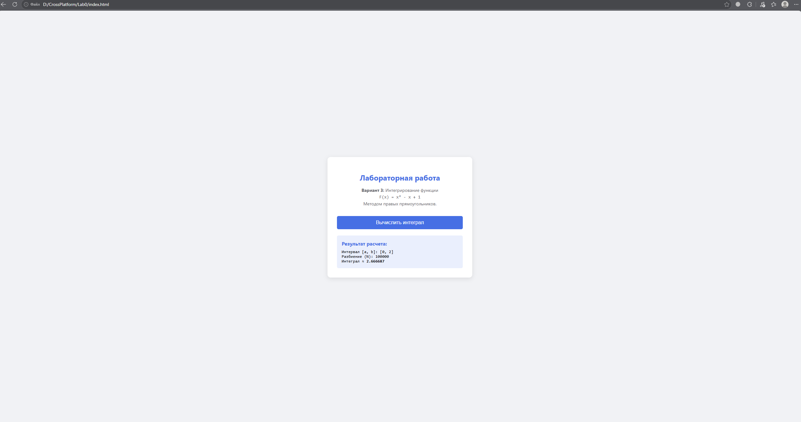

# Лабораторная работа: Численное интегрирование

Проект выполнен в рамках дисциплины **«Кросс-платформенная разработка»**.  
Приложение представляет собой веб-калькулятор для вычисления определенного интеграла методом численного интегрирования (метод прямоугольников Римана).

---

## Вариант задания

* **Вариант №3**
* **Подынтегральная функция:** $$F(x) = x^2 - x + 1$$
* **Метод интегрирования:** Метод правых прямоугольников (*Right Riemann Sum*)

---

## Скриншот работы программы

  

---

## Особенности реализации

- **Кросс-платформенность:** Код написан на чистом (Vanilla) JavaScript и работает в любом современном веб-браузере на любой операционной системе (Windows, macOS, Linux, Android, iOS).
- **Функции высшего порядка (First-Class Functions):** Алгоритм интегрирования реализован универсально — функция `integrate(func, a, b, n)` принимает интегрируемую функцию `func` в качестве callback-параметра.
- **Интерактивный ввод:** Пределы интегрирования $a$ и $b$ запрашиваются у пользователя с помощью функции `prompt()`.
- **Защита от некорректного ввода:** Реализована замена запятой на точку (для удобного ввода дробных чисел) и валидация через `isNaN()`.
- **Высокая точность:** Используется разбиение на $N = 100\,000$ отрезков, что обеспечивает точность до 5–6 знаков после запятой.

---

## Математическая модель

Метод правых прямоугольников аппроксимирует площадь под графиком функции суммой площадей прямоугольников, высота которых вычисляется на **правой** границе каждого элементарного отрезка:

$$\int_{a}^{b} f(x)\,dx \approx \sum_{i=1}^{n} f(x_i) \cdot \Delta x$$

где:
* $\Delta x = \frac{b - a}{n}$ — ширина одного шага разбиения.
* $x_i = a + i \cdot \Delta x$ — координата правой границы $i$-го отрезка ($i = 1, 2, \dots, n$).

---

## Тестовые данные для проверки

Точное аналитическое значение интеграла:  
$$\int (x^2 - x + 1) \,dx = \frac{x^3}{3} - \frac{x^2}{2} + x$$

| Пределы $[a, b]$ | Точное значение (аналитическое) | Результат программы |
| :---: | :---: | :---: |
| **$[0, 2]$** | $8/3 \approx \mathbf{2.666667}$ | `2.666687` |
| **$[0, 1]$** | $5/6 \approx \mathbf{0.833333}$ | `0.833333` |
| **$[1, 3]$** | $20/3 \approx \mathbf{6.666667}$ | `6.666727` |
| **$[-2, 2]$** | $28/3 \approx \mathbf{9.333333}$ | `9.333253` |

